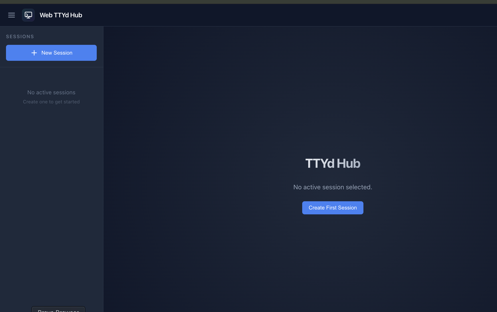

# Web TTYd Hub

> Your terminal, in the browser. Anytime, anywhere.



Web TTYd Hub is a web-based terminal session manager built on ttyd + tmux. Create, manage, and switch between multiple terminal sessions right from your browser -- whether you're at your desk or on your phone.

## Why

- A long-running task on your work machine, and you want to check on it from home?
- Lying in bed with a sudden idea to fix a bug, wishing you could just open a terminal?
- Out and about with only your phone, wanting to connect to your dev machine?

**Web TTYd Hub** turns your terminal into a web service. Open a browser, and you're in. Sessions never die.

## Features

- **Multi-session management** -- Create multiple independent terminal sessions, switch freely
- **Persistent sessions** -- Powered by tmux, sessions survive browser closures, reconnect anytime
- **Collaborative access** -- Multiple browsers can connect to the same session simultaneously
- **Multi-shell support** -- Choose from Bash, Zsh, Fish and more when creating a session
- **Mobile-friendly** -- Responsive UI that works smoothly on phones and tablets
- **Dark UI** -- Refined Slate/Zinc theme with smooth animations
- **Zero-config startup** -- One command to launch after installing dependencies

## Prerequisites

- **Node.js** >= 18
- **ttyd** -- Web terminal emulator
- **tmux** -- Terminal multiplexer

### macOS

```bash
brew install ttyd tmux
```

### Ubuntu/Debian

```bash
sudo apt install tmux
# For ttyd, see https://github.com/tsl0922/ttyd#installation
```

## Quick Start

```bash
# Install dependencies
npm install
cd frontend && npm install && cd ..

# Build frontend
npm run build

# Start server
npm start
```

Open [http://localhost:8384](http://localhost:8384) in your browser.

## Development Mode

```bash
npm run dev
```

Starts the backend (port 8384) and the Vite dev server (port 5173) concurrently.

## Configuration

Set via environment variables or a `.env` file:

| Variable                | Description              | Default   |
| ----------------------- | ------------------------ | --------- |
| `PORT`                  | Server listen port       | `8384`    |
| `HOST`                  | Listen address           | `0.0.0.0` |
| `TTYD_PORT_RANGE_START` | ttyd port range start    | `7681`    |
| `TTYD_PORT_RANGE_END`   | ttyd port range end      | `7780`    |

## Security Notice

This tool is designed for **personal use on trusted networks**. There is no authentication -- anyone with network access can create, view, and delete terminal sessions. Do not expose it to the public internet without adding your own authentication layer (e.g., reverse proxy with auth).

## License

MIT
